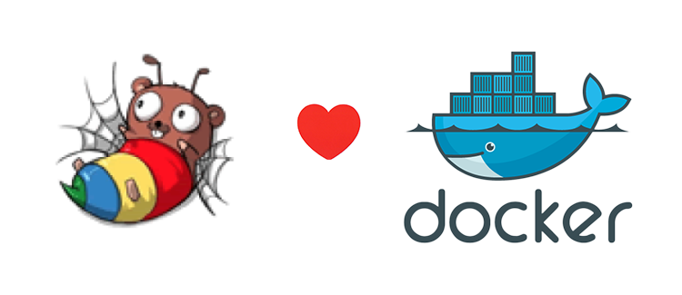

# Beego Dev



## Introduction

Build beego development environment with one command. Docker handles these for you.

* Install Golang 1.4
* Configurate GOPATH and PATH
* Install [beego](https://github.com/astaxie/beego) and [bee](https://github.com/beego/bee)
* Automatically load the code from local

No need to install go at all and it allows you to write code with your favorite IDE.

## Usage

Take [seagull](https://github.com/tobegit3hub/seagull) as an example, we may `git clone https://github.com/tobegit3hub/seagull /seagull`.

```
docker run -i -t --net=host -v /seagull:/go/src/github.com/tobegit3hub/seagull tobegit3hub/beego-dev
```

Then `cd src/github.com/tobegit3hub/seagull/` and `bee run` may work to run seagull locally.

The option `--net=host` allows you to access beego application within docker container. And `-v` will load your code from local. Make sure put your project in `/go` which is the GOPATH of container.

